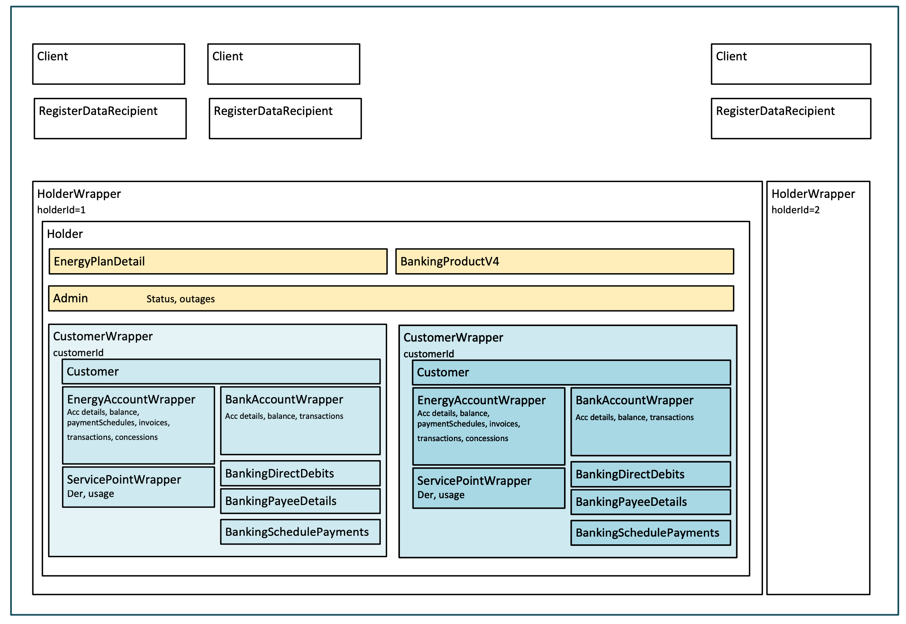

# Consumer Data Right Test Data CLI

## Overview

The CDR testdata CLI can be used to generate manufactured test data for the Consumer Data Right standards.  This CLI allows the configuration, through an option file, of a variety of data `factories` that can be used to generate test files with different characteristics.  This project is also designed to allow for additional `factories` to be added via Pull Request to accommodate different scenarios.

This tool has been created by the [Data Standards Body](https://consumerdatastandards.gov.au/) to support participants implementing of the [technical standards](https://github.com/ConsumerDataStandardsAustralia/standards) developed for the Australian Consumer Data Right regime.

The goal of the testdata CLI is to provide support for CDR participants seeking to test their implementations to ensure confidence that they have covered a wide range of possible scenarios liked to be encountered in production scenarios.

## CLI Usage

To install the testdata command line tool (`testdata`) you need to have npm installed.  With npm installed run the following command:
`npm install @cds-au/testdata -g`

This will make the CLI available globally.

### Test Data Commands

|Command|Options|Arguments|Description|Examples|
|-|-|-|-|-|
|`schema`|`vonly`|None|Print out the test data schema currently in use to stdout.  This will be the full JSON schema file and allows for the schema to be reused in your own tools or workflow|`testdata schema`|
||||Output only the version of the schema that the CLI is currently using|`testdata schema --vonly`|
|`factories`|None|None|List the factories that are currently implemented with a short description of each factory describing its purpose|`testdata factories`|
|`factory`|None|`<factory-id>`,  the ID of the factory that documentation is requested for|Give detailed documentation for a specific factory including the purpose of the factory, the data that it generates or modifies and the options that it consumes.|`testdata factory load-static-data`|
|`generate`|None|`<opts>` the options file for the data generation process|Read in the specified options file and generate a data file in the file specified as the destination.  The resulting file will contain JSON consistent with the test data schema supported by the CLI.|`testdata generate options.json data.json` Generate test data using the options in the `options.json` file and output the resulting data to the `data.json` file.|
|||`<dst>`, the destination file for the generated output.  The contents will always be JSON consistent with the test data schema|||


### Building and running the cli locally

To build the repository and use the library without installing it globally

1. Install libraries
`npm install`

2. Build
`npm run build`

3. Use npm link
`npm link @cds-au/testdata`

# Data Generation Process

## Schema

The data generator utilises one or more data factories and creates data by excuting the individual factories.

This data generation logic does not impose any restrictions on the detailed data contents, it merely relies on a high-level structure which is required to programmatically generate data. In particular, this approach allows for the development
and incorporation of data factories, which deliberately generate invalid
data.


This high-level structure is depicted in the diagram below.


*Figure 1: ConsumerDataRightTestDataJSONSchema*

A single data factory can be designed to generate a complete data set
containing all structures defined in
ConsumerDataRightTestDataJSONSchema, or generate a one or more specific
data structures (eg EnergyAccountData and EnergyInvoiceData). This
allows for a great deal of flexibility and reusability. 

Run `testdata factories` to view all currently available factories, and locate the underlying data generation code in the `src/facrories` directories.

To view a description and the capability of a factory run 
`testdata factory <FACTORY_NAME>`

Eg, `testdata factory create-customers` will return

```
Supported capabilities include:
    create a customer
    create a set of customers
    ...
```

Most of data factories in this repository will take into account the conditional property dependencies, optional and mandatory requirements, and randonly select enumerated types for each data structure generated.
That is, these will generate **valid** data and this data can be validated against the schemas defined by by the [Data Standards Body](https://consumerdatastandards.gov.au/), eg [energy schemas](https://consumerdatastandardsaustralia.github.io/standards/#cdr-energy-api-schemas).

A set of valid data factories can be found in this repository (`src/factories`) grouped by sector (see folders for banking, energy, etc) as well as the common factories (see common folder).

This framework also allows for the deliberate generation of **invalid** data, which can be usefull for particular test harness configuration. The `src\factories\invalid-factories` folder contains some examples of such invalid factories

Additionally, the framework can read in a static file and augment this file with additional data. An example of this is the `loadStatic` factory. More information on data augmentation can be found [here](#data-augmentation).

## Generate Data Command

To generate data issue the follwing command. 

`testdata generate <opts> <dst>`

|Argument|Description|
|-|-|
|`<opts>`| The options file indicating the factories to execute, in what order and with what options specified. |
|`<dst>`| The destination file for the generated output.  The contents will always be JSON consistent with the test data schema. |


## Options File
The options file (`<opts>`) is a **mandatory** input for the `testdata generate` command and it has to adhere to the schema defined in the  file `src\logic\options.ts`.
This schema defines the hierachical dependencies between factories. 

```ts
{
  general?: OptionsGeneral,

  factories?: {
    allDataFactory?: OptionsFactory,

    holdersFactory?: OptionsFactory,
    holders?: [
      {
        count?: OptionsItemCount,

        holderFactory?: OptionsFactory,
        unauthenticated?: {
          banking?: {
            productsFactory?: OptionsFactory
          },
          energy?: {
            plansFactory?: OptionsFactory
          },
          admin?: {
            statusFactory?: OptionsFactory,
            outagesFactory?: OptionsFactory
          }
        },
        authenticated?: {
          customersFactory?: OptionsFactory,
          customers?: [
            {
              count?: OptionsItemCount;
              customerFactory?: OptionsFactory,

              banking?: {
                accountsFactory?: OptionsFactory,
                accounts?: [{
                  count?: OptionsItemCount;
                  accountFactory?: OptionsFactory,
                  balanceFactory?: OptionsFactory,
                  transactionsFactory?: OptionsFactory,
                }],
                directDebitsFactory?: OptionsFactory,
                payeesFactory?: OptionsFactory,
                scheduledPaymentsFactory?: OptionsFactory
              },
              energy?: {
                accountsFactory?: OptionsFactory,
                accounts?: [{
                  count?: OptionsItemCount;
                  accountFactory?: OptionsFactory,
                  balanceFactory?: OptionsFactory,
                  invoicesFactory?: OptionsFactory,
                  transactionsFactory?: OptionsFactory,
                  concessionsFactory?: OptionsFactory,
                  paymentScheduleFactory?: OptionsFactory
                }],
                servicePointsFactory?: OptionsFactory,
                servicePoints?: [{
                  count?: OptionsItemCount;
                  servicePointFactory?: OptionsFactory,
                  derFactory?: OptionsFactory,
                  usageFactory?: OptionsFactory,
                }]
              }
            }
          ]
        }
      }
    ],

    clientCacheFactory?: OptionsFactory,

    registerCacheFactory?: OptionsFactory
  }
```

The options file drives the behaviour of the data generation. The process is configured via the existence (or absence) of OptionsFactory properties defined under the factories object. (see `options.ts`). This will determine the extend of data detail the `generate` command will create.

An options file can utilise any number of factories. For instance, the `samples\options\simple-full.json` options file utilses a single factory (sse `factories\static-factories\simple-ull.ts`) to implement a complete data set.
The options file `samples\options\create-combined.json` utilises a range of individual factories, each with specific configurations to cerate a complete data set.

## Data Factoroies

The data factories in `src/factories` contain the code to generate the data taking into account the configuration from the options file.
Additional factories can be developed and added to the relevant folder, which will make the factory available to the cli.

A factory (OptionsFactory) can be implemented as a Sequence factory, Weighted factory, or a Single factory.

| Factory Type | Description |
|-|-|
| OptionsSingleFactory | A single factory which will be executed. |
| OptionsSequence | Multiple factories which will be executed in sequence. Eg, see UC4 |
| OptionsWeighteg | Multiple factories of which one will be executed and for the execution the selection is random and based on a weighting. Eg UC6 |

Additionally, each factory may have factory specific options. These can be used to fine-tune the data being generated. To get the options available for a factory.

`testdata factory <FACTORY_NAME>`

Eg, `testdata factory create-customers` will return

```
This factory supports the follow option fields:

  type:    The type must be either 'person' or 'organisation'. This will determine if a 
           CommonPersonDetail or a CommonOrganisationDetail structure will be created.

```

## General Options

The general section in the options file can be used to capture information about the generated data set.

Should this section does not exists in the options file, the generic template response will be created

```json
    "general": {
        "fileVersion": "1.0.0",
        "standardsVersion": "1.20.0",
        "title": "Automatically generated data file",
        "description": "Test data generated by the CDR Test Data CLI",
    }
```
*Additionally the setting `individualFileOutDir` can be added to the general options. This will create a folder for each data holder and generated a single file for each customer (CustomerWrapper) in the directory specified.
This may be useful in some situations, especially where larger data sets are to be generated.*

## Data Augmentation

The data generation can augment an existing data file. To achieve this the `factories:allDataFactory` has to be defined.
For instance,a data file with previously generated data may need to be augmented with additional holders (UC5), or a data file with only product exists (unauthenticated) and some customer data needs to be added (UC4), or Client and RegisterRecipient data may exists in a file, but no data holder data.
The `loadStatic` factory can be used to load a static file.
The `allDataFactory` implementation will simply use whatever input file is specified as the base dataset.

# Examples

For each of these example naviate to the root of this repository

## Use Case 1 (UC1)

Generate some energy plan data, which is compliant with the CDR. (unauthenticated data)

`testdata generate ./options/uc1.json ./output/u1-output.json`

## Use Case 2 (UC2)

Generate customers, some of them should residential, some of them business customers.

`testdata generate ./options/uc2.json ./output/u2-output.json`

## Use Case 3 (UC3)
Generate a single residential customer with a single energy account.

`testdata generate ./options/uc3.json ./output/u3-output.json`

## Use Case 4 (UC4)
Generate a single residential customer with a single energy account with detailed transactions, billing and usage data.

`testdata generate ./options/uc4.json ./output/u4-output.json`

## Use Case 5 (UC5)
Generate a single residential customer with a single energy account with detailed transactions, billing and usage data.

`testdata generate ./options/uc5.json ./output/u5-output.json`

## Use Case 6 (UC6)
Generate a single residential customer with a single energy account with detailed transactions, billing and usage data.

`testdata generate ./options/uc6.json ./output/u6-output.json`


# Maintenance

Enhancement and bug fix pull requests are welcome in accordance with the contribution policy for the repository.

For additional contribution please ensure that pull requests are fully tested and include updates to documentation.
